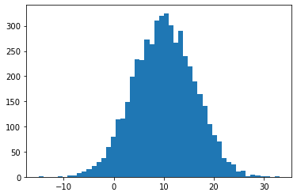
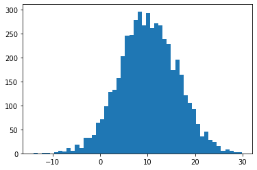

# biuR
> An extract of the BIU R functionality, without any dependency on <a href='https://github.com/thiesgehrmann/biuR'>biu</a>.


## Install

`pip install biuR`

## How to use

```python
import biur
import matplotlib.pylab as plt
import pandas as pd
```

```python
R = biur.R()
```

## Push some data

```python
R.push(n=5000, mean=10, var=6, question="How many apples do you eat per day?")
```

## Run some commands

```python
R("""
    dist <- rnorm(n, mean, var)
    print(mean(dist))
""", get=False)
```

    [1] 10.02596


## Get some data

```python
dist = R.get("dist")
dist_alt = R("dist", get=True) # the get parameter is True by default
_ = plt.hist(dist, bins=50)
```





## Do it all at the same time

```python
dist = R("""rnorm(n, mean, var)""",
         push=dict(n=5000, mean=10, var=6, question="How many apples do you eat per day?"))
_ = plt.hist(dist, bins=50)
```





## Dataframes also work as expected

```python
df  = pd.DataFrame(dist.reshape(500,10), columns=["C%d" % (i+1) for i in range(10)])
df2 = R("""df*2""", push=dict(df=df))
df2.describe()
```


<div>
<style scoped>
    .dataframe tbody tr th:only-of-type {
        vertical-align: middle;
    }

    .dataframe tbody tr th {
        vertical-align: top;
    }

    .dataframe thead th {
        text-align: right;
    }
</style>
<table border="1" class="dataframe">
  <thead>
    <tr style="text-align: right;">
      <th></th>
      <th>C1</th>
      <th>C2</th>
      <th>C3</th>
      <th>C4</th>
      <th>C5</th>
      <th>C6</th>
      <th>C7</th>
      <th>C8</th>
      <th>C9</th>
      <th>C10</th>
    </tr>
  </thead>
  <tbody>
    <tr>
      <th>count</th>
      <td>500.000000</td>
      <td>500.000000</td>
      <td>500.000000</td>
      <td>500.000000</td>
      <td>500.000000</td>
      <td>500.000000</td>
      <td>500.000000</td>
      <td>500.000000</td>
      <td>500.000000</td>
      <td>500.000000</td>
    </tr>
    <tr>
      <th>mean</th>
      <td>19.483522</td>
      <td>20.526126</td>
      <td>20.795463</td>
      <td>19.830822</td>
      <td>19.966503</td>
      <td>21.357578</td>
      <td>19.955829</td>
      <td>19.687476</td>
      <td>19.659160</td>
      <td>19.973759</td>
    </tr>
    <tr>
      <th>std</th>
      <td>12.335198</td>
      <td>11.628605</td>
      <td>12.231484</td>
      <td>11.886862</td>
      <td>11.419686</td>
      <td>11.657351</td>
      <td>11.500650</td>
      <td>11.501253</td>
      <td>12.668158</td>
      <td>12.182259</td>
    </tr>
    <tr>
      <th>min</th>
      <td>-23.604096</td>
      <td>-19.317664</td>
      <td>-13.852837</td>
      <td>-18.492268</td>
      <td>-14.829335</td>
      <td>-26.297393</td>
      <td>-10.214214</td>
      <td>-16.114489</td>
      <td>-26.525327</td>
      <td>-12.705910</td>
    </tr>
    <tr>
      <th>25%</th>
      <td>10.769325</td>
      <td>13.167645</td>
      <td>12.920961</td>
      <td>12.197403</td>
      <td>12.409445</td>
      <td>14.051357</td>
      <td>12.018763</td>
      <td>11.624662</td>
      <td>11.547831</td>
      <td>11.355280</td>
    </tr>
    <tr>
      <th>50%</th>
      <td>19.751316</td>
      <td>20.304215</td>
      <td>20.499023</td>
      <td>19.934705</td>
      <td>19.236623</td>
      <td>21.403425</td>
      <td>19.947370</td>
      <td>19.999798</td>
      <td>20.293528</td>
      <td>20.140320</td>
    </tr>
    <tr>
      <th>75%</th>
      <td>27.447524</td>
      <td>28.246787</td>
      <td>28.522705</td>
      <td>28.167066</td>
      <td>28.447994</td>
      <td>28.833786</td>
      <td>27.165384</td>
      <td>27.484840</td>
      <td>28.118585</td>
      <td>28.075203</td>
    </tr>
    <tr>
      <th>max</th>
      <td>58.805833</td>
      <td>52.976081</td>
      <td>58.818565</td>
      <td>57.953478</td>
      <td>63.160386</td>
      <td>68.383550</td>
      <td>61.659418</td>
      <td>53.538999</td>
      <td>52.457741</td>
      <td>54.278089</td>
    </tr>
  </tbody>
</table>
</div>


## Some additional stuff

### Dates

```python
from datetime import datetime
R("""print(today)""", push=dict(today=datetime.today()), get=False)
```

    [1] "2021-09-27 14:14:03 CEST"


### Dictionaries

> Note that individual numbers do not exist in R (everything is a vector) so it is impossible to transform this back perfectly.

```python
R.push(mydict={"A":10, "B":20, "C":40})
R("""
    mydict$D <- 60
    mydict""")
```


    {'A': [10], 'B': [20], 'C': [40], 'D': [60.0]}


